# Spillway

**A model gateway and a durable agent runtime in one Go service, with a dashboard that shows what it is doing.**

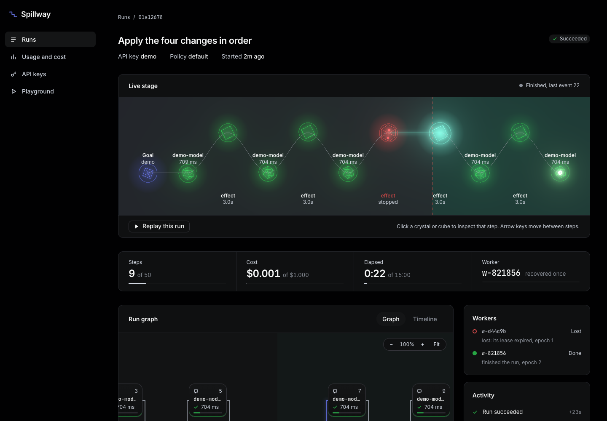

Two jobs, one service:

1. **Gateway.** One OpenAI-compatible API in front of several model providers. It routes, falls back when a provider
   fails, caches, rate limits, enforces budgets and records what every call cost.
2. **Agent runs.** You post a goal and a list of tools. Spillway loops model call, tool call, model call until the model
   is done, and writes every step to Postgres. If the worker process dies, another one picks the run up where it stopped.

The name fits both: a spillway is the safe overflow path when the main channel fails.

> **Why build it?** Calling a model is easy. Keeping a long agent run alive through a provider outage, a deploy, or a
> `kill -9`, without sending the same email twice, is the part teams get wrong. This is that part, with the failure
> modes made visible.

---

## See it work in 30 seconds

```bash
make up            # Postgres and Redis in Docker, once
scripts/demo.sh    # builds, starts a tiny stack, kills a worker mid-call, shows the result
```

The script starts a run that calls a side-effecting tool four times, `kill -9`s the worker while the third call is in
flight, starts a new worker, and prints the run's log. This is a real output (trimmed to the interesting rows):

```
5   2  tool_call   started   w-d44c9b  1  tool=effect
6   2  tool_call   finished  w-d44c9b  1  result={"ok":true,"applied":true}
...
13  6  tool_call   started   w-d44c9b  1  tool=effect                      <- worker killed here
14  6  tool_call   reissued  w-821856  2  after w-d44c9b (epoch 1)         <- another worker took over
15  6  tool_call   finished  w-821856  2  result={"ok":true,"applied":false}
...
22  -  run_status  finished  w-821856  2  status=succeeded

receiver: {"effects_applied":4,"keys_seen":4,"redelivered_and_ignored":1}
```

Four steps, four effects, one request arrived twice and was applied once. That last part is the receiver honouring the
idempotency key; see [Known limits](#known-limits).

The same run in the dashboard (replay of the recovery, from the real run above):

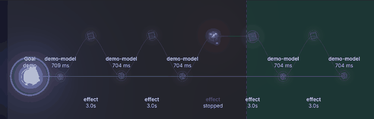

---

## What you can do with it

### Watch runs, and see which ones need you

The **Runs** page shows what is running, what is asleep, what is waiting for a person, and what finished. A run that
needs approval is lifted to the top.

| Dark | Light |
|---|---|
| 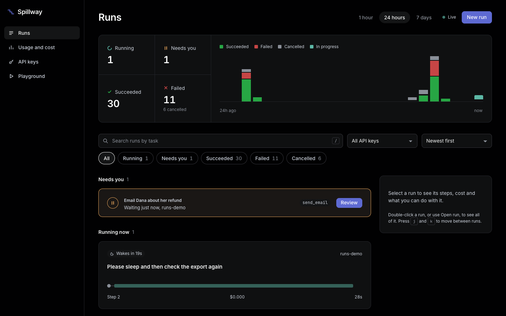 | 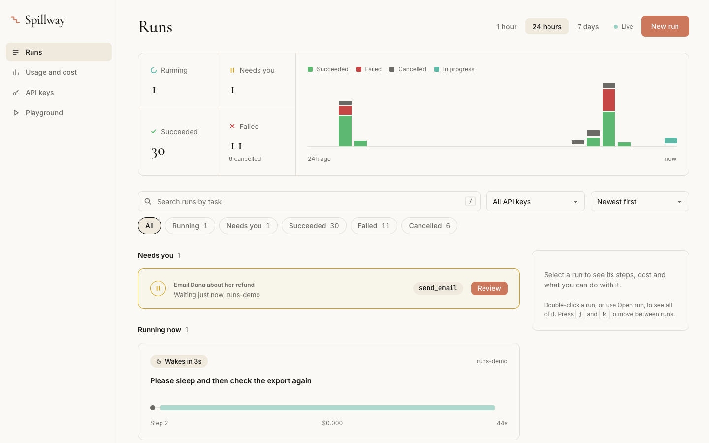 |

### Open a run and see exactly what happened

Every run has a live 3D stage, a graph, a timeline, a "where the time went" waterfall, and an inspector. Crystals are
model calls, cubes are tool calls. A worker that was lost shows as a dashed attempt, and the cut shows where another
worker took over.

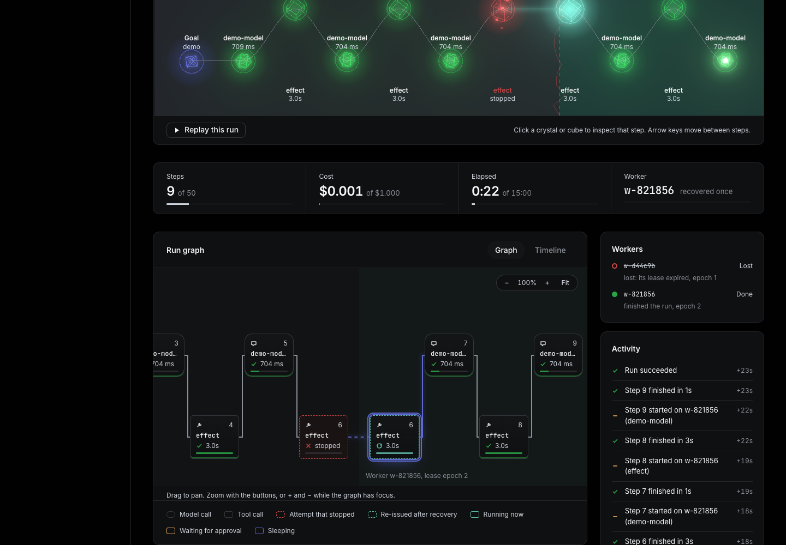

The timeline is the same story as a list, with each step's input, output, idempotency key and the worker that ran it:

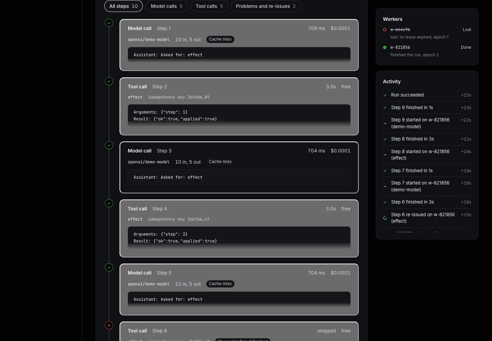

### Put a person in the loop

A tool can be marked "asks first". The run stops before calling it, shows the person exactly what is about to happen
(an email is shown as an email), and waits. Nothing holds the run while it waits: approve it a week later, on a
different machine, and it continues.

| Admin | Viewer |
|---|---|
| 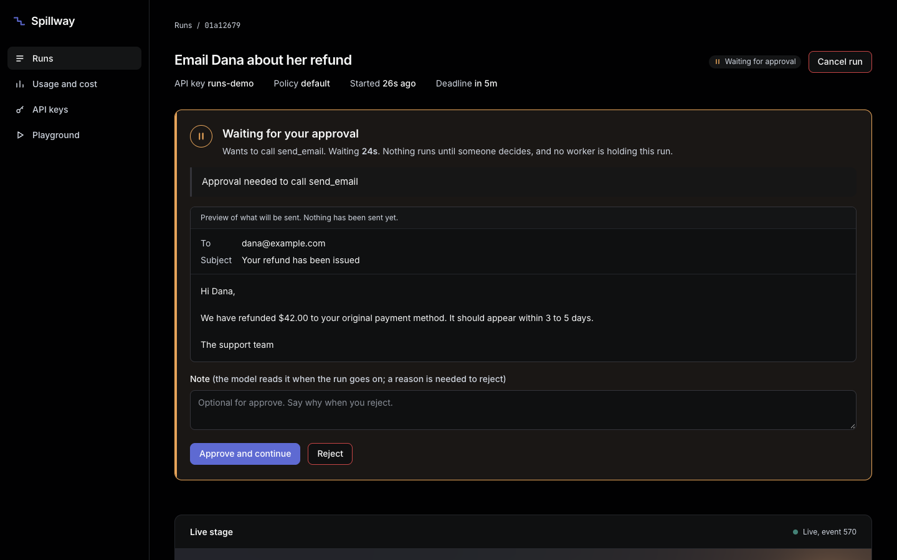 | 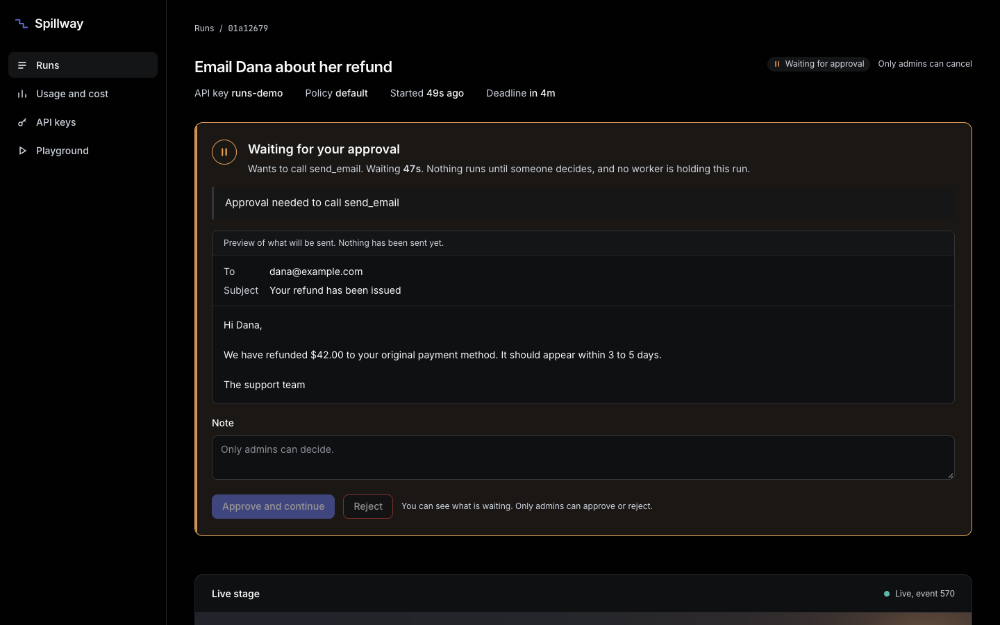 |

Viewers see everything and can decide nothing. Rejecting asks for a reason, and the run ends as failed with that reason
on record:

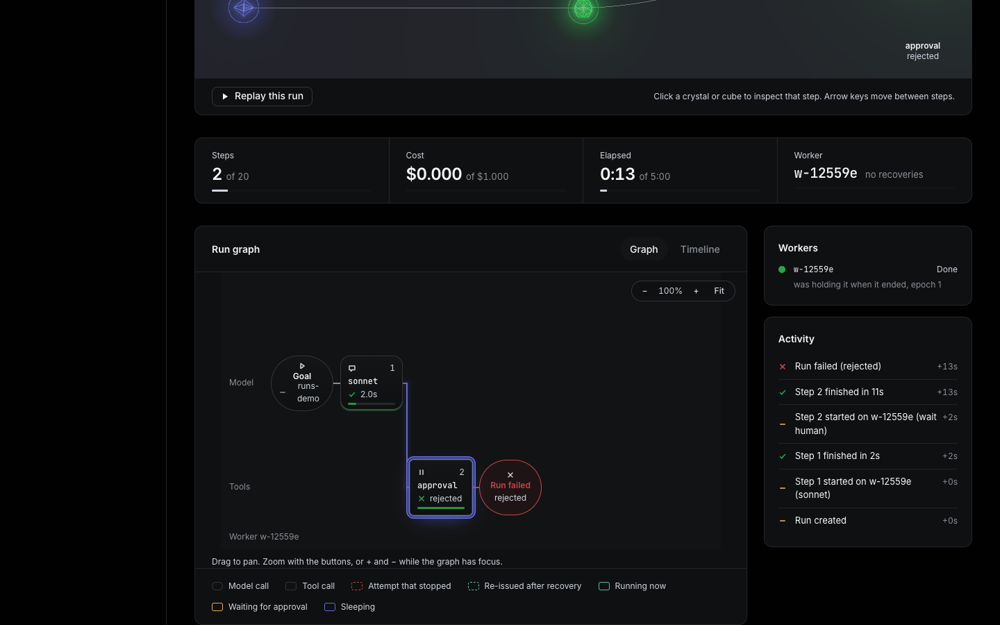

The same card in the light theme: [approval-light.png](docs/img/approval-light.png).

### Let an agent sleep

An agent can ask to wait ("check again in ten minutes"). The run goes to sleep, no worker is held, and it wakes at the
time. The deadline still applies.

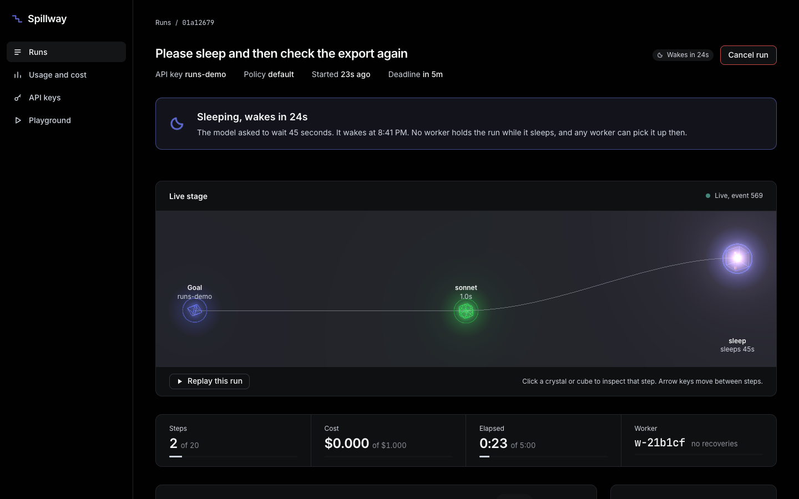

### Give runs tools: plain HTTP, or MCP servers

Register an HTTP endpoint or an MCP server once (with its auth headers, stored encrypted). A run names the tools it may
use and nothing else. Calls are signed, and carry an idempotency key.

```bash
spillway tools add send_email --endpoint https://tools.example/email --requires-approval
spillway tools add files --kind mcp --endpoint https://mcp.example/mcp --header "Authorization: Bearer ..." --discover
spillway runs create --tools send_email,files.read "Email Dana her refund receipt"
```

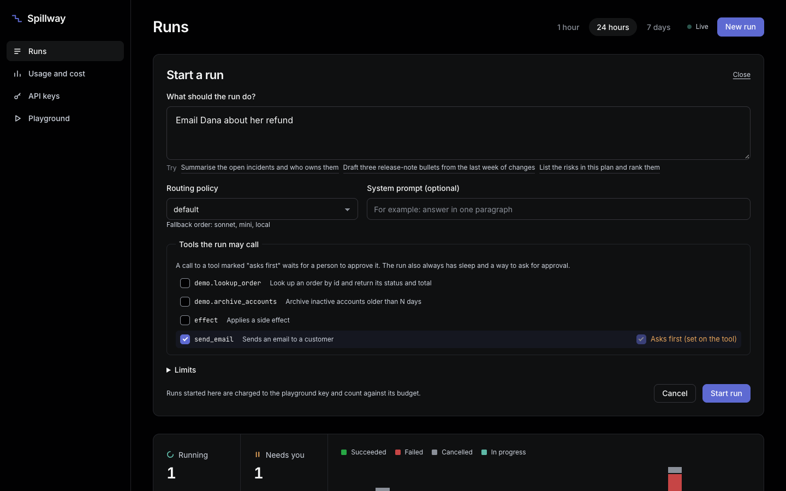

### Use it as a gateway, and see what it costs

Point any OpenAI SDK at `http://localhost:8080/v1` with a Spillway key. The **Usage and cost** page breaks down
requests, tokens, spend, latency and cache hits by key, model and day.

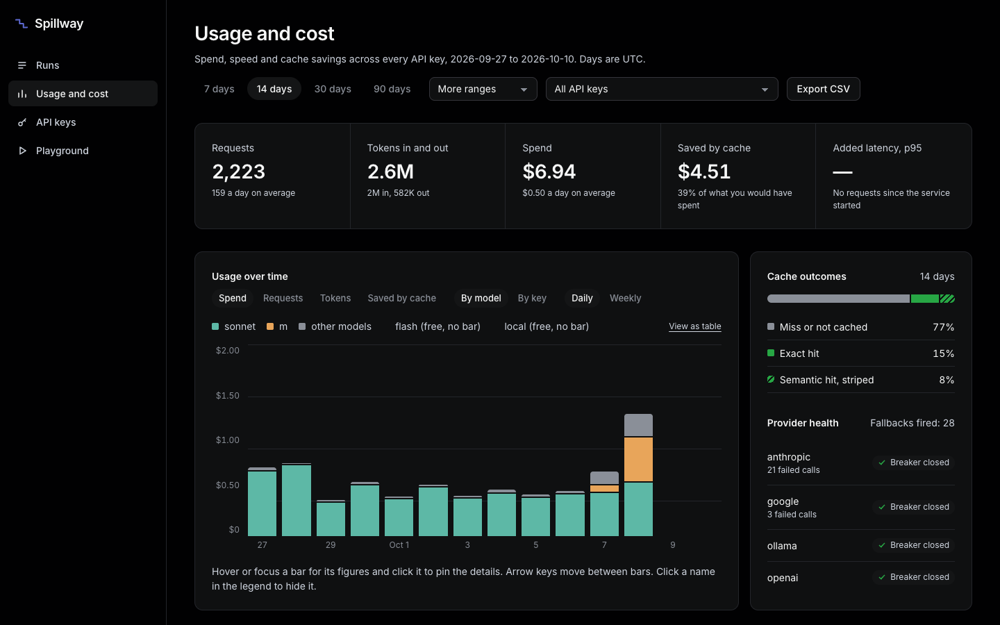

**API keys** carry their own rate limit, monthly budget and cache setting. Keys are shown once and stored hashed:

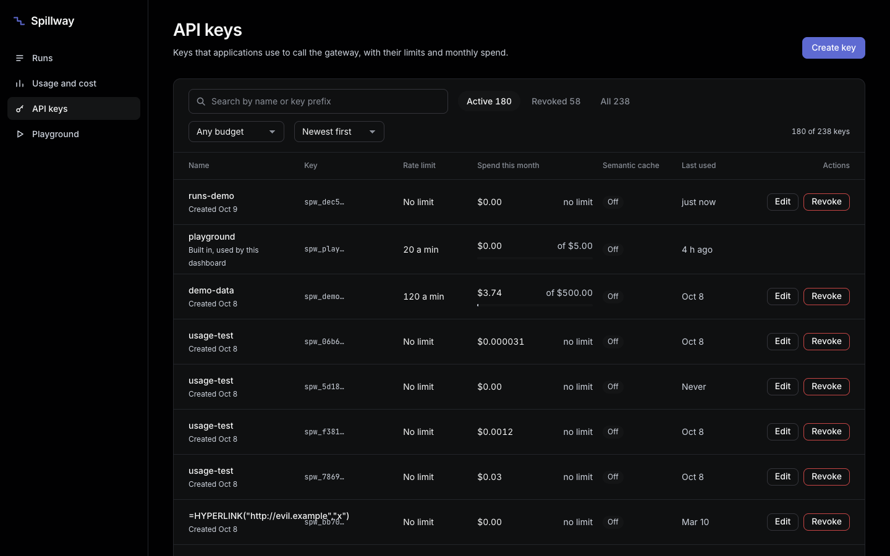

### Break things on purpose

The **Playground** sends a prompt through a routing policy and draws the route it took. You can inject a provider
failure (rate limit, server error, timeout) to watch fallback and the circuit breaker work. Injection works only from the
playground, only for admins, and never reaches the production endpoint.

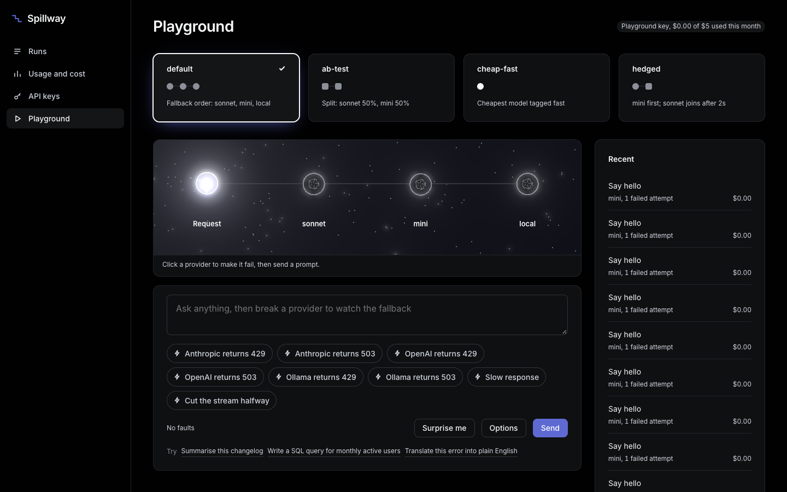

---

## How it works

```
                     ┌───────────────────────────── Spillway (Go) ─────────────────────────────┐
  your app ─ /v1/chat/completions ─▶ auth ▶ plan ▶ rate limit ▶ budget ▶ cache ▶ executor ──▶ OpenAI
  (OpenAI SDK)                        │                                          │  retries      Anthropic
                                      │                                          │  breaker      Google
  your app ─ POST /v1/runs ──────────▶│ runs table (a projection + a lease)      │  fallback     Ollama
                                      │        ▲                                 │
                                      │        │ claim, heartbeat, fenced append │
                                      │   workers ── model call ─ through the gateway above
                                      │        └──── tool call ─ HTTP or MCP, signed, idempotency key
                                      └────────────────────────────┬─────────────────────────────┘
                              Postgres (run_steps = the log, usage, keys, tools)    Redis (limits, cache)
                                                                  │
  dashboard (Next.js) ◀── session-token proxy ◀── /admin/* ◀─────┘     /metrics (Prometheus), OpenTelemetry
```

**The gateway path.** Each request is authenticated, planned (which model, in what fallback order), checked against the
key's rate limit and budget, looked up in the cache, then executed with retries, a per-provider circuit breaker and
fallback. Streams fail over only before the first byte, because after that the client has already seen output.

**The run path.** `run_steps` is an append-only log and the source of truth. A run's state is whatever you get by
replaying it. A worker claims a run with a lease, renews it by heartbeat, and writes each step with a fenced insert. The
`runs` row is only a projection for fast listing.

Routing policies you can configure in `config/models.yaml`: a fixed model with fallbacks, an ordered fallback chain, the
cheapest model with a tag, a weighted A/B split with sticky buckets, and hedging (start the next model if the first is
slow).

---

## Design decisions

**Why an append-only step log.** A crash can happen between any two lines of code. If state is a log, resuming is
replaying it, and "what happened" is a query rather than a guess. It also makes the dashboard honest: the graph is
drawn from the same rows the engine resumes from.

**Why leases and a fencing epoch.** A worker that is paused for a minute (a GC stall, a laptop lid) looks dead, so
another worker takes over. The paused one then wakes up and tries to write. Each claim bumps `lease_epoch`, and every
append is `INSERT ... WHERE the lease still matches`, so the old worker's write is refused. A unique index on terminal
rows is the second line of defence.

**Why re-issue instead of "exactly once".** No system can make a remote side effect happen exactly once on its own. What
it can do is send the same idempotency key every time (`sha256(run_id : step_no)`) and record, in the log, that a step
was re-issued. A receiver that honours the key gets exactly-once; one that ignores it gets at-least-once, and the log
tells you which steps to look at.

**Why the run loop lives in the runtime.** The client states a goal, tools and limits. The runtime owns the loop, the
limits (steps, cost, deadline), compaction, approvals and sleeping. That is what makes crash recovery possible without
the client's cooperation.

**Why approvals and sleeps release the run.** A run waiting for a person holds no lease and no worker. The decision is
a row in the log, so it works when the original worker is long gone. Time spent waiting for a person does not count
against the deadline.

**What I would change at 100x.**
- Postgres is the queue (`FOR UPDATE SKIP LOCKED`). That is fine to thousands of runs per second; past that, move claims to
  a dedicated queue and keep Postgres as the log.
- `run_steps` needs partitioning by time and an archive path for old runs.
- The usage write queue is in-process. At scale it should be a stream with replay.
- The event stream uses Postgres `LISTEN/NOTIFY` as a wakeup. Many API instances would want a shared fan-out.
- Budgets are checked before a call and recorded after it, so they are approximate under heavy concurrency. A reservation
  scheme in Redis would make them tight.

---

## Results

Measured on an Apple M5 Pro (15 CPUs, 24 GB), one gateway process, Postgres and Redis in Docker on the same machine.
Full method and caveats are in [bench/results.md](bench/results.md).

| | Result |
|---|---|
| **Gateway overhead** (p50 / p95 / p99, added over a direct call) | **0.20 / 0.28 / 0.50 ms** |
| **Throughput**, one instance, 32 clients | **5,283 requests/s**, 0 failed |
| **Exact cache** on a repeated workload (2,000 requests, 300 distinct prompts) | **88.7% hit rate**, 88.7% of spend avoided (illustrative prices) |
| **Chaos test** (worker `kill -9` at random, runs sleep and wait for approval too) | every run succeeds, **0 duplicated side effects**; redeliveries deduplicated by key |
| **Tests** | about 630 Go tests with `-race` (unit and integration), 455 frontend tests with `vitest-axe` |

Notes on reading these honestly:
- The upstream in the latency test is a fake provider with no delay, so the overhead is the gateway alone. A real
  provider adds its own time to both sides equally.
- The semantic cache (Ollama embeddings, pgvector) is tested for correctness but has no hit-rate number yet.
- The chaos test runs 50 runs in CI. Locally it runs with `CHAOS_RUNS=10`: 10 runs, 5 worker kills, 11 steps re-issued,
  0 duplicated effects.

Reproduce:

```bash
make chaos                                   # reduced chaos test (10 runs)
go run ./cmd/fakeprovider -addr :9990 -text ok &
SPILLWAY_CONFIG=bench/models.yaml spillway serve --role=api --addr=:8081 &
go run ./bench -gateway http://localhost:8081 -key $KEY
```

---

## Run it yourself

You need Go 1.26 or later, Docker, and Node 20 or later.

```bash
cp .env.example .env           # edit the passwords and ADMIN_SESSION_SECRET
make up                        # Postgres (pgvector) and Redis
make migrate seed              # schema, and the admin and viewer accounts from .env
make serve                     # the API on :8080 (add your provider keys to .env, or use the fake provider below)

cd web && npm install && npm run dev      # the dashboard on :3000
```

No provider keys? Use the fake one. It speaks the OpenAI protocol and can return errors and delays on demand:

```bash
go run ./cmd/fakeprovider -addr :9999 &
# then point a provider's base_url in config/models.yaml at http://localhost:9999/v1
```

Then:

```bash
go run ./cmd/spillway keys create --name me               # prints the key once
export SPILLWAY_API_KEY=spw_...
curl localhost:8080/v1/chat/completions -H "Authorization: Bearer $SPILLWAY_API_KEY" \
  -H 'content-type: application/json' -d '{"model":"default","messages":[{"role":"user","content":"hello"}]}'
go run ./cmd/spillway runs create --wait "Summarise the open incidents"
```

Model prices in `config/models.yaml` are placeholders until you fill in current provider prices; cost shows as $0
until you do. The dashboard's two roles: **admin** can change things, **viewer** can only look.

### Useful commands

| | |
|---|---|
| `make test` | unit and integration tests with `-race` (needs `make up`) |
| `make chaos` | the crash test, reduced to 10 runs |
| `make demo` | the crash-recovery demo above |
| `make demo-data` | invented usage numbers, so the dashboard has something to show |
| `spillway keys create\|list\|revoke` | API keys |
| `spillway tools add\|list\|discover\|rm` | tool and MCP server registry |
| `spillway runs create\|get\|steps\|approve\|reject\|cancel` | runs, over the HTTP API |
| `/metrics` | Prometheus; try `sum by (outcome) (rate(spillway_gateway_requests_total[5m]))` |

---

## Known limits

Stated plainly:

- **Exactly-once side effects depend on the receiver.** Spillway re-issues an interrupted step with the same idempotency
  key and says so in the log. If the tool does not deduplicate by that key, the effect can happen twice. The same holds
  for MCP servers, which receive the key in `_meta`.
- **Budgets are approximate.** Spend is checked before a call and recorded after it, so concurrent calls can overshoot
  a budget by a little.
- **Streams cannot fail over after the first byte.** The client gets an error chunk.
- **Model calls inside runs are not streamed.** The timeline shows whole steps appearing, not tokens.
- **A run nobody decides stays waiting** past its deadline until someone approves, rejects or cancels it.
- **MCP:** streamable HTTP only, tools only (no resources, prompts or sampling), static auth headers (no OAuth).
- **Compaction uses a heuristic** (characters / 4) to decide when to summarise, and has only been run against the fake
  provider.
- **No tools screen in the dashboard.** Tools are managed with the CLI and the API; the New run form can pick them.
- **No deployment packaging yet.** There are no Dockerfiles for the service or the dashboard; Docker is used for
  Postgres and Redis only.
- **Price numbers are placeholders** until filled with current provider prices.
- **One known console warning:** a React hydration notice (#418) on every dashboard page. It is cosmetic.

---

## Where things are

| | |
|---|---|
| `cmd/spillway` | the binary: `serve`, `migrate`, `seed`, `keys`, `tools`, `runs` |
| `cmd/fakeprovider`, `cmd/fakereceiver` | a fake model provider, and a tool endpoint that honours idempotency keys |
| `internal/gateway`, `internal/provider` | routing, cache, limits, executor; one adapter per provider |
| `internal/runs` | the run engine: replay, leases, approvals, sleep, compaction |
| `internal/tools` | the tool registry, HTTP executor and MCP client |
| `internal/api` | the public `/v1` API and the dashboard's `/admin` API (`api/openapi.yaml`) |
| `web/` | the Next.js dashboard |
| `config/models.yaml` | models, prices, routing policies, limits |
| `docs/SPEC.md`, `docs/TECHNICAL.md` | what was decided, and how it is built (with the deviations listed) |
| `bench/` | the load and cache benchmark, and its results |

License: Apache-2.0.
