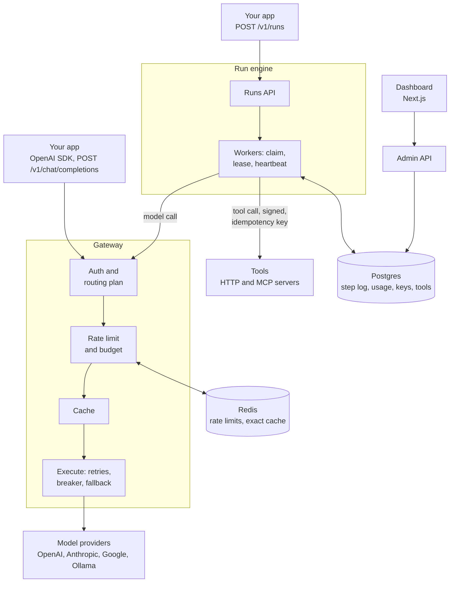
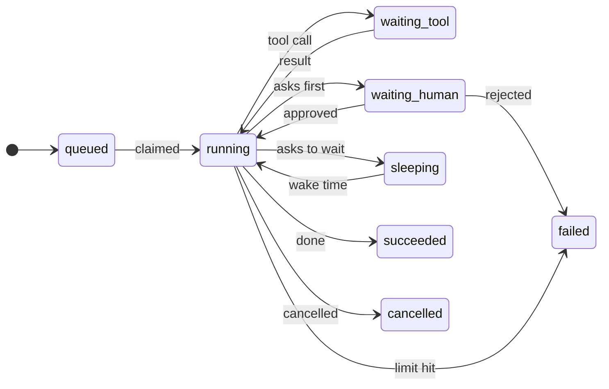

# Spillway

**A model gateway and a durable agent runtime in one Go service, with a dashboard that shows what it is doing.**


Two jobs, one service:

1. **Gateway.** One OpenAI-compatible API in front of several model providers. It routes, falls back when a provider
   fails, caches, rate limits, enforces budgets and records what every call cost.
2. **Agent runs.** You post a goal and a list of tools. Spillway loops model call, tool call, model call until the model
   is done, and writes every step to Postgres. If the worker process dies, another one picks the run up where it stopped.

The name fits both: a spillway is the safe overflow path when the main channel fails.

> **Why build it?** Calling a model is easy. Keeping a long agent run alive through a provider outage, a deploy, or a
> `kill -9`, without sending the same email twice, is the part teams get wrong. This is that part, with the failure
> modes made visible.

---

## See it work in 30 seconds

```bash
make up            # Postgres and Redis in Docker, once
scripts/demo.sh    # builds, starts a tiny stack, kills a worker mid-call, shows the result
```

(Needs bash: macOS, Linux, or WSL on Windows. Setup is under [Run it yourself](#run-it-yourself).)

The script starts a run that calls a side-effecting tool four times, `kill -9`s the worker while the third call is in
flight, starts a new worker, and prints the run's log. This is a real output (trimmed to the interesting rows):

```
5   2  tool_call   started   w-d44c9b  1  tool=effect
6   2  tool_call   finished  w-d44c9b  1  result={"ok":true,"applied":true}
...
13  6  tool_call   started   w-d44c9b  1  tool=effect                      <- worker killed here
14  6  tool_call   reissued  w-821856  2  after w-d44c9b (epoch 1)         <- another worker took over
15  6  tool_call   finished  w-821856  2  result={"ok":true,"applied":false}
...
22  -  run_status  finished  w-821856  2  status=succeeded

receiver: {"effects_applied":4,"keys_seen":4,"redelivered_and_ignored":1}
```

Four steps, four effects, one request arrived twice and was applied once. That last part is the receiver honouring the
idempotency key; see [Known limits](#known-limits).

The same run in the dashboard (replay of the recovery, from the real run above):


---

## What you can do with it

### Watch runs, and see which ones need you

The **Runs** page shows what is running, what is asleep, what is waiting for a person, and what finished. A run that
needs approval is lifted to the top.

| Dark | Light |
|---|---|
|  |  |

### Open a run and see exactly what happened

Every run has a live 3D stage, a graph, a timeline, a "where the time went" waterfall, and an inspector. Crystals are
model calls, cubes are tool calls. A worker that was lost shows as a dashed attempt, and the cut shows where another
worker took over.


The timeline is the same story as a list, with each step's input, output, idempotency key and the worker that ran it:


### Put a person in the loop

A tool can be marked "asks first". The run stops before calling it, shows the person exactly what is about to happen
(an email is shown as an email), and waits. Nothing holds the run while it waits: approve it a week later, on a
different machine, and it continues.

| Admin | Viewer |
|---|---|
|  |  |

Viewers see everything and can decide nothing. Rejecting asks for a reason, and the run ends as failed with that reason
on record:


The same card in the light theme: [approval-light.png](docs/img/approval-light.png).

### Let an agent sleep

An agent can ask to wait ("check again in ten minutes"). The run goes to sleep, no worker is held, and it wakes at the
time. The deadline still applies.


### Give runs tools: plain HTTP, or MCP servers

Register an HTTP endpoint or an MCP server once (with its auth headers, stored encrypted). A run names the tools it may
use and nothing else. Calls are signed, and carry an idempotency key.

```bash
spillway tools add send_email --endpoint https://tools.example/email --requires-approval
spillway tools add files --kind mcp --endpoint https://mcp.example/mcp --header "Authorization: Bearer ..." --discover
spillway runs create --tools send_email,files.read "Email Dana her refund receipt"
```


### Use it as a gateway, and see what it costs

Point any OpenAI SDK at `http://localhost:8080/v1` with a Spillway key. The **Usage and cost** page breaks down
requests, tokens, spend, latency and cache hits by key, model and day.


**API keys** carry their own rate limit, monthly budget and cache setting. Keys are shown once and stored hashed:


### Break things on purpose

The **Playground** sends a prompt through a routing policy and draws the route it took. You can inject a provider
failure (rate limit, server error, timeout) to watch fallback and the circuit breaker work. Injection works only from the
playground, only for admins, and never reaches the production endpoint.


---

## How it works



The life of a run:



If a worker dies while a run is `running` or `waiting_tool`, its lease runs out and another worker claims the run and
carries on from the log.

**The gateway path.** Each request is authenticated, planned (which model, in what fallback order), checked against the
key's rate limit and budget, looked up in the cache, then executed with retries, a per-provider circuit breaker and
fallback. Streams fail over only before the first byte, because after that the client has already seen output.

**The run path.** `run_steps` is an append-only log and the source of truth. A run's state is whatever you get by
replaying it. A worker claims a run with a lease, renews it by heartbeat, and writes each step with a fenced insert. The
`runs` row is only a projection for fast listing.

Routing policies you can configure in `config/models.yaml`: a fixed model with fallbacks, an ordered fallback chain, the
cheapest model with a tag, a weighted A/B split with sticky buckets, and hedging (start the next model if the first is
slow).

---

## Results

Measured on an Apple M5 Pro (15 CPUs, 24 GB), one gateway process, Postgres and Redis in Docker on the same machine.
Full method and caveats are in [bench/results.md](bench/results.md).

| | Result |
|---|---|
| **Gateway overhead** (p50 / p95 / p99, added over a direct call) | **0.20 / 0.28 / 0.50 ms** |
| **Throughput**, one instance, 32 clients | **5,283 requests/s**, 0 failed |
| **Exact cache** on a repeated workload (2,000 requests, 300 distinct prompts) | **88.7% hit rate**, 88.7% of spend avoided (illustrative prices) |
| **Chaos test** (worker `kill -9` at random, runs sleep and wait for approval too) | every run succeeds, **0 duplicated side effects**; redeliveries deduplicated by key |
| **Tests** | about 630 Go tests with `-race` (unit and integration), 455 frontend tests with `vitest-axe` |

Notes on reading these honestly:
- The upstream in the latency test is a fake provider with no delay, so the overhead is the gateway alone. A real
  provider adds its own time to both sides equally.
- The semantic cache (Ollama embeddings, pgvector) is tested for correctness but has no hit-rate number yet.
- The chaos test runs 50 runs in CI. Locally it runs with `CHAOS_RUNS=10`: 10 runs, 5 worker kills, 11 steps re-issued,
  0 duplicated effects.

Reproduce:

```bash
make chaos                                   # reduced chaos test (10 runs)
go run ./cmd/fakeprovider -addr :9990 -text ok &
SPILLWAY_CONFIG=bench/models.yaml spillway serve --role=api --addr=:8081 &
go run ./bench -gateway http://localhost:8081 -key $KEY
```

---

## Run it yourself

### 1. Install what you need

You need **Go 1.26 or newer**, **Node.js 20 or newer** (with npm), **Docker** with Compose, and **git**. Docker runs
Postgres and Redis; everything else runs on your machine. macOS, Linux and Windows are covered below.

<details open>
<summary><b>macOS</b></summary>

```bash
# Homebrew (https://brew.sh) if you do not have it
brew install go node git
brew install --cask docker      # then open the Docker app once, so the engine starts
xcode-select --install          # gives you `make`
```
</details>

<details>
<summary><b>Linux (Debian or Ubuntu)</b></summary>

```bash
sudo apt update && sudo apt install -y git make curl

# Go: the apt package is usually too old. Use the official tarball (any 1.26+ from https://go.dev/dl/).
curl -LO https://go.dev/dl/go1.26.0.linux-amd64.tar.gz
sudo rm -rf /usr/local/go && sudo tar -C /usr/local -xzf go1.26.0.linux-amd64.tar.gz
echo 'export PATH=$PATH:/usr/local/go/bin' >> ~/.profile && . ~/.profile

# Node.js 22
curl -fsSL https://deb.nodesource.com/setup_22.x | sudo -E bash - && sudo apt install -y nodejs

# Docker Engine with Compose, then log out and back in so your user may use it
curl -fsSL https://get.docker.com | sh && sudo usermod -aG docker $USER
```

On Fedora use `dnf` for git, make and nodejs; on Arch use `pacman`. Go and Docker install the same way.
</details>

<details>
<summary><b>Windows</b></summary>

**Easiest: WSL 2.** In an administrator PowerShell run `wsl --install`, restart, and open the Ubuntu app. Install
[Docker Desktop](https://www.docker.com/products/docker-desktop/) and turn on *Settings, Resources, WSL integration* for
Ubuntu. Then follow the **Linux** steps above inside Ubuntu, clone the repository *inside* the Ubuntu filesystem (not under
`/mnt/c`), and use the macOS and Linux commands below as written.

**Native, without WSL.** In PowerShell:

```powershell
winget install GoLang.Go OpenJS.NodeJS.LTS Git.Git Docker.DockerDesktop
```

Restart PowerShell, start Docker Desktop once, and use the *Windows (PowerShell)* commands below. Windows has no `make`
and no bash, so `scripts/demo.sh` and the `make` shortcuts need WSL; the PowerShell commands cover everything else.
</details>

### 2. Get the code and download the dependencies

The same on every system:

```bash
git clone https://github.com/abdullah-9211/Spillway.git
cd Spillway
go mod download                 # Go dependencies
cd web && npm install && cd ..  # dashboard dependencies
```

### 3. Configure, start, and sign in

This uses the built-in fake model provider, so you need no API keys. It answers like an OpenAI-compatible model and can
be told to fail, which is also how the demo works.

**macOS, Linux, WSL**

```bash
cp .env.example .env                       # then edit it, see the three lines below
cp web/.env.example web/.env.local
make up                                    # Postgres and Redis in Docker, waits until healthy
make migrate seed                          # creates the schema and the admin and viewer accounts

go run ./cmd/fakeprovider -addr :9989 &    # the fake model provider
make serve                                 # terminal 1: the API and workers on :8080
cd web && npm run dev                      # terminal 2: the dashboard on :3000
```

**Windows (PowerShell)**

```powershell
copy .env.example .env                     # then edit it, see the three lines below
copy web\.env.example web\.env.local
docker compose up -d --wait

# Load .env into this PowerShell window. Repeat this line in every new window you open for the Go service.
Get-Content .env | Where-Object { $_ -match '^\s*[A-Za-z_]+=' } | ForEach-Object { $k, $v = $_ -split '=', 2; Set-Item "env:$k" $v }

go run ./cmd/spillway migrate
go run ./cmd/spillway seed

Start-Process powershell -ArgumentList '-NoExit','-Command','go run ./cmd/fakeprovider -addr :9989'
go run ./cmd/spillway serve                # this window: the API and workers on :8080

# in a second PowerShell window:
cd web; npm run dev                        # the dashboard on :3000
```

**The three lines to change in `.env`** (they work with the fake provider and the seeded accounts; also give the four `SEED_*` passwords at least 8 characters):

```
SPILLWAY_CONFIG=config/demo.yaml
OPENAI_API_KEY=anything
ADMIN_SESSION_SECRET=<any long random string, e.g. the output of: openssl rand -base64 32>
```

Open <http://localhost:3000> and sign in with `SEED_ADMIN_USER` and `SEED_ADMIN_PASSWORD` from your `.env` (or the
viewer account to see the read-only view).

**Use real providers instead.** Leave `SPILLWAY_CONFIG=config/models.yaml`, put your `ANTHROPIC_API_KEY`,
`OPENAI_API_KEY` and `GOOGLE_API_KEY` in `.env`, and check the `upstream` model ids and prices in
`config/models.yaml` (the prices there are placeholders).

### 4. Make a first call

```bash
go run ./cmd/spillway keys create --name me          # prints an API key once: spw_...
export SPILLWAY_API_KEY=spw_...                      # PowerShell: $env:SPILLWAY_API_KEY = "spw_..."

go run ./cmd/spillway runs create --wait "Summarise the open incidents"
curl localhost:8080/v1/chat/completions -H "Authorization: Bearer $SPILLWAY_API_KEY" \
  -H 'content-type: application/json' -d '{"model":"default","messages":[{"role":"user","content":"hello"}]}'
```

On Windows PowerShell use `curl.exe`, and put the JSON body in a file with `-d @body.json`.
The run appears on the dashboard's Runs page as it executes.

### 5. Run the demo and the tests

| | macOS, Linux, WSL | Windows (PowerShell) |
|---|---|---|
| Crash-recovery demo | `make up && scripts/demo.sh` | use WSL |
| Go tests | `make test` | `go test ./...` (integration tests also need `docker compose up -d --wait`) |
| Reduced chaos test | `make chaos` | use WSL |
| Dashboard tests | `cd web && npm test` | `cd web; npm test` |
| Demo data for the usage page | `make demo-data` | use WSL |

The Go tests run with `-race` through `make`; the race detector needs a C compiler on Windows, which is why the
PowerShell line leaves it out.

### Everyday commands

```bash
spillway keys create | list | revoke            # API keys
spillway tools add | list | discover | rm       # tools and MCP servers
spillway runs create | get | steps | approve | reject | cancel
```

Use `go run ./cmd/spillway ...` while developing. `/metrics` serves Prometheus; try
`sum by (outcome) (rate(spillway_gateway_requests_total[5m]))`.

---

## Known limits

- **Exactly-once side effects depend on the receiver.** Spillway re-sends the same idempotency key after a crash and
  records the re-issue. A tool that ignores the key can apply the effect twice. The same holds for MCP servers.
- **Budgets are approximate.** Spend is checked before a call and recorded after, so concurrent calls can overshoot a
  little.
- **Streams cannot fail over after the first byte**, and model calls inside runs are not streamed.
- **A run nobody decides stays waiting** past its deadline until someone approves, rejects or cancels it.
- **MCP is tools-only over streamable HTTP** with static auth headers.
- **No deployment packaging.** Docker is used for Postgres and Redis only.
- **Prices in `config/models.yaml` are placeholders.** The semantic cache has no hit-rate number yet.

More detail on what was decided and why is in [docs/SPEC.md](docs/SPEC.md) and [docs/TECHNICAL.md](docs/TECHNICAL.md).

License: Apache-2.0.
